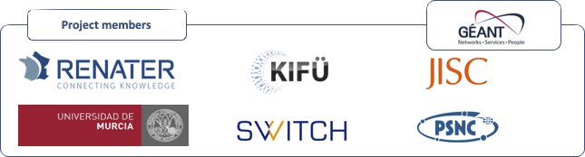
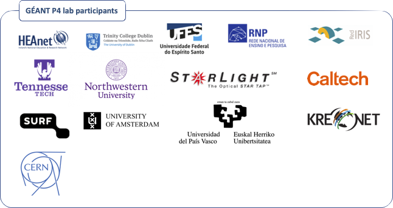

**RARE** is a **[GÉANT](https://www.geant.org)** project from the **[GÉANT fourth programme](https://www.geant.org/Projects/GEANT_Project_GN4-3)** (GN4-3)

## Useful links

- [freeRtr open source control plane](http://freertr.org)
- [RARE/freeRtr project page](http://rare.freertr.org)
- [A team's member journey with RARE/freeRtr](http://blog.freertr.org)

## Project members

## GÉANT P4 lab participants
[**RARE**](https://wiki.geant.org/display/RARE) has also deployed a GÉANT P4 lab. Initially, it was meant to be used as test environment in order to validate RARE project software and it was planned that the lab had European coverage only. Since then, organisations from various horizon have expressed interest in RARE work and proposed interconnection to this P4 lab. You can have an up to date view of the Worldwide P4 lab [here](https://www.google.com/maps/d/edit?mid=1Wp7jZHZfBlnerO27MJJmcYdk2qV69FVk&usp=sharing).

  
