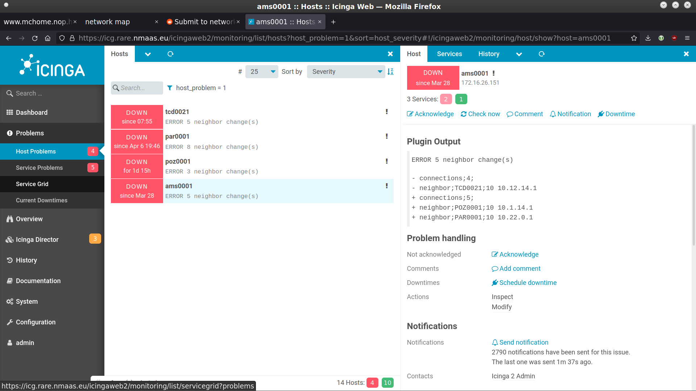

# ** a way to get rid of snmp - part 1, the igp monitoring **

The link state igp protocols flood the complete topology description in lsa/lsp packets so all the routers in a given area/level have the same view.
It also means that if you have a box that can report the whole topology, it's unnecessary to bother all the other boxes about these questions.
For it to work, it's necessary to have the show outputs formatted for machine processing, moreover the known good topology also need to be fixed.
And exactly this is what rare/freerouter could do: once you set up your igp peering, you just define that which show commands you would monitor, and train these to the current state.
Afterwards, you point your monitoring tools to the box and that's it: once the topology changes, the shows will output something different what it produced when you trained them and it'll generate an alert and tell you the difference.
Here are some configs from the geant p4 testbed: in this case the monitoring pointed exclusively to the bud0001 node and it easily reports about the ams0001 peerings:


Acknowledging the changes in the network is also as easy as issuing the train command again:
```
BUD0001#configure
BUD0001(cfg)#check ospfv4-10.1.1.1
BUD0001(cfg-check)#show running-config this
check ospfv4-10.1.1.1
 command sho ipv4 ospf 1 topo 0 10.1.1.1
 template ospf4temp
 require-text category;value;addition
 require-text node;10.1.1.1;
 require-text name;AMS0001;
 require-text stub;false;
 require-text connections;4;
 require-text prefixes;0 1 0 0;
 require-text neighbor;FRA0001;10 10.1.12.1
 require-text neighbor;PAR0101;10 10.1.110.1
 require-text neighbor;TCD0021;10 10.12.14.1
 require-text neighbor;CHI0041;10 10.30.68.1
 require-text addprefix;10.1.1.1/32;10
 exit
!

BUD0001(cfg-check)#train
BUD0001(cfg-check)#show config-differences
check ospfv4-10.1.1.1
 no require-text neighbor;TCD0021;10 10.12.14.1
 no require-text connections;4;
 require-text connections;5;
 require-text neighbor;POZ0001;10 10.1.14.1
 require-text neighbor;PAR0001;10 10.22.0.1
 exit

BUD0001(cfg-check)#
```

Afterwards, that topology info is written in the config again, so changes to the current state will be alerted. the results could be taken away by a wide variety of monitoring protocols, including nrpe, prometheus, netconf, restapi, streaming telemetry, and so on.
